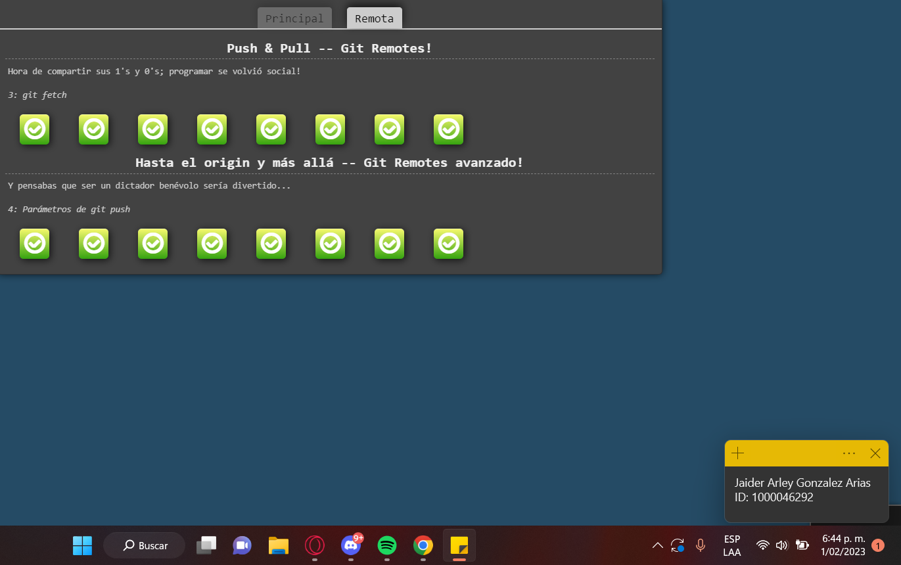

# Perfil del estudiante


## Información general:
**Nombre:** Jaider Arley González Arias\
**Edad:** 20\
**Universidad:** Escuela Colombiana de Ingeniería Julio Garavito\
**Semestre:** 8\
**Título:** técnico en programación de software\
**Intereses:** obtener un perfil como programador full stack\
El plan de estudios actualizado del estudiante se encuentra en el siguiente enlace: <https://www.escuelaing.edu.co/es/programas/ingenieria-de-sistemas/>


## Primer código desarrollado por el estudiante:
```
def is_prime(n):
    if n <= 1:
        return False
    for i in range(2, n):
        if n % i == 0:
            return False
    return True

number = int(input("Enter a number: "))
if is_prime(number):
    print(number, "is a prime number")
else:
    print(number, "is not a prime number") 
```
## Datos sobre la universidad:
La Escuela Colombiana de Ingeniería Julio Garavito es una prestigiosa institución de educación superior en Colombia, cuenta con programas como:
- Ingeniería de Sistemas.
- Ingeniería Civil.
- Ingeniería Electrónica.
- Matemáticas.
- Ingeniería Industrial.
- Ingeniería Biomédica.
- Ingeniería Mecánica.
- Ingeniería Ambiental. 

Entre otros.\
Específicamente para **ingeniería de sistemas** hay 8 énfasis:
1. Ingeniería de Software.
2. Arquitectura Tecnológica y Seguridad.
3. Sistemas y Organizaciones.
4. Informática Matemática.
5. Ingeniería en Inteligencia Artificial.
6. Analytics.
7. Emprendimiento.
8. Gerencia de Proyectos.
### Principio ético
>_"Ser responsable, integro y comprometido con el desarrollo sostenible y el bienestar de la sociedad"_

<center>

## Pruebas GIT BRANCHING
### Main:
<center>

### Remote:

<center>